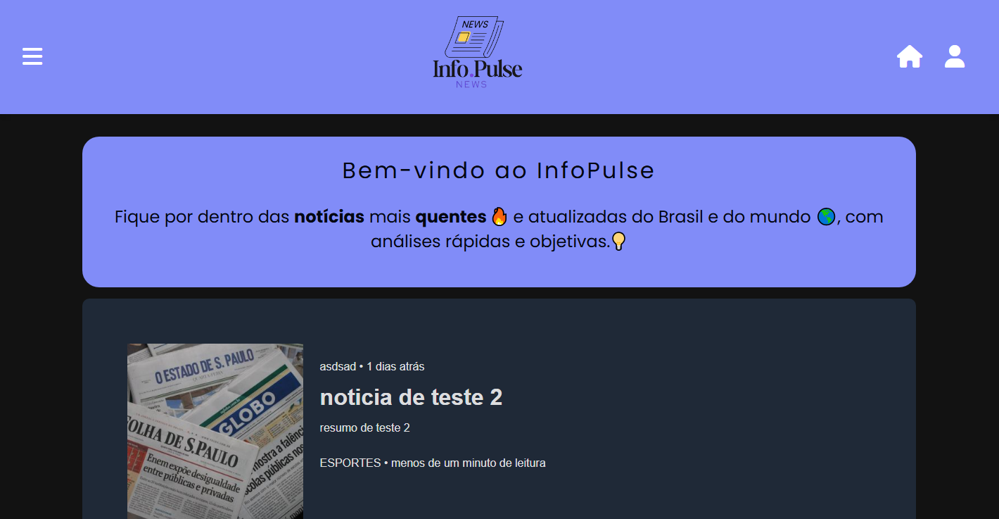
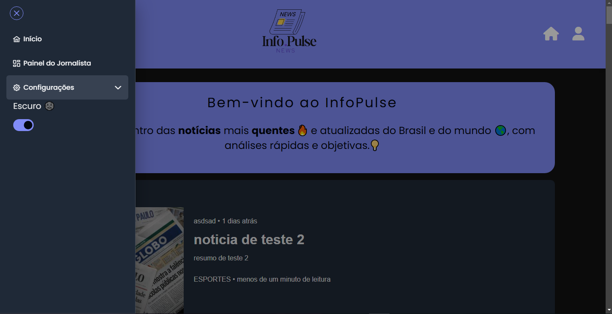
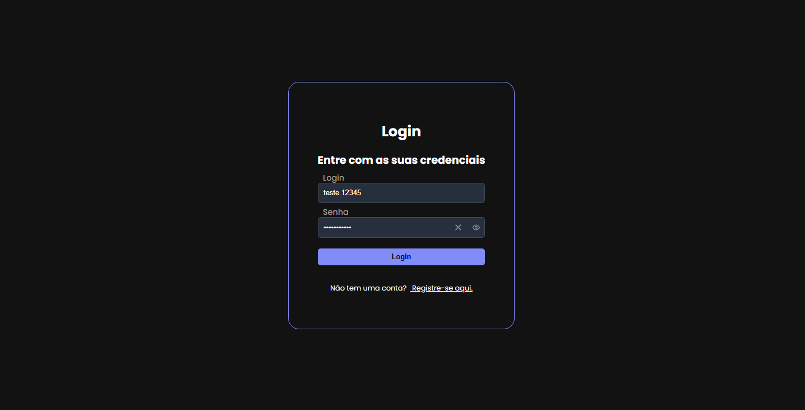
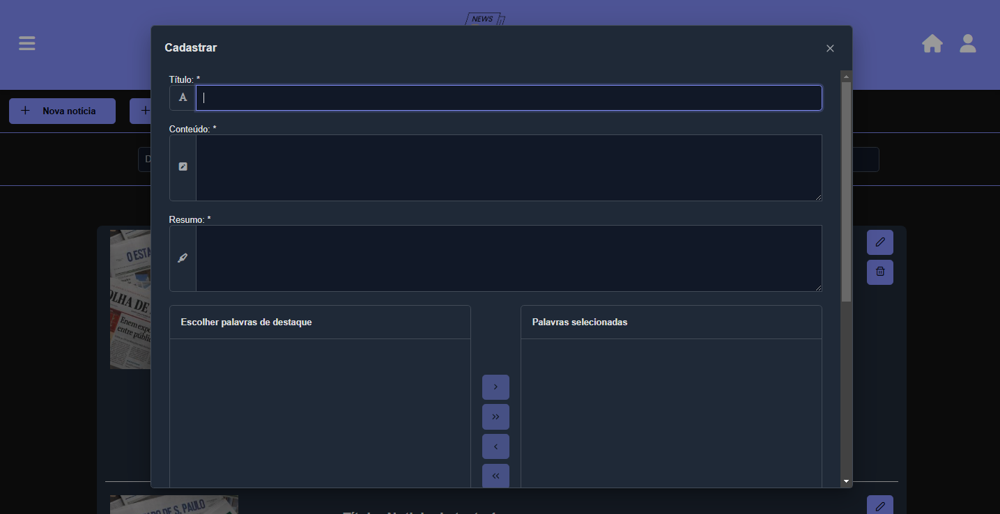
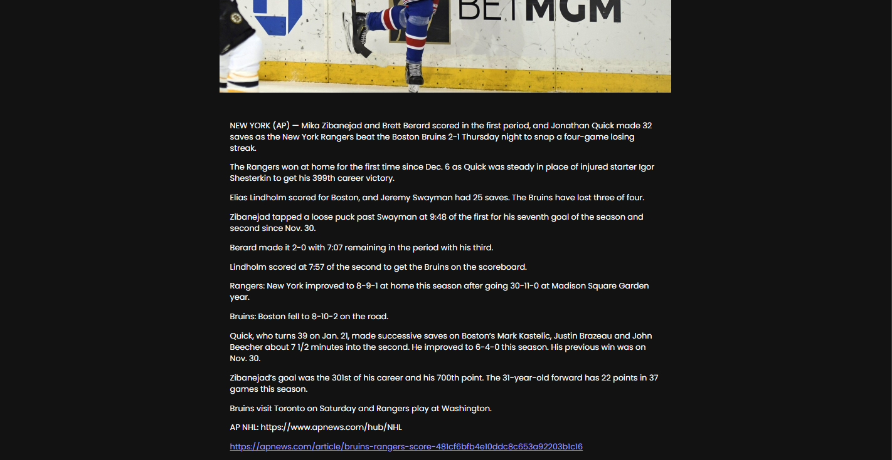

<h1 align="center">
  <a href="https://github.com/AbrahamLica/InfoPulse_frontend">
    <!-- Please provide path to your logo here -->
    
  </a>
</h1>

[JAVASCRIPT__BADGE]: https://img.shields.io/badge/Javascript-000?style=for-the-badge&logo=javascript
[TYPESCRIPT__BADGE]: https://img.shields.io/badge/typescript-D4FAFF?style=for-the-badge&logo=typescript
[ANGULAR__BADGE]: https://img.shields.io/badge/Angular-red?style=for-the-badge&logo=angular

![javascript][JAVASCRIPT__BADGE]
![typescript][TYPESCRIPT__BADGE]
![angular][ANGULAR__BADGE]

<div align="center">
  📰 InfoPulse - Your Web News System
  <br />
  <a href="#about"><strong>Explore the screenshots »</strong></a> 
  <br />
  If you are looking for the PT-BR version, <a href="https://github.com/AbrahamLica/InfoPulse_frontend/README_PTBR">click here</a>
  <br />
  <br />
  🐞 <a href="https://github.com/AbrahamLica/InfoPulse_frontend/issues/new?assignees=&labels=bug&template=01_BUG_REPORT.md&title=bug%3A+">Report a Bug</a>
  ·
  ✨ <a href="https://github.com/AbrahamLica/InfoPulse_frontend/issues/new?assignees=&labels=enhancement&template=02_FEATURE_REQUEST.md&title=feat%3A+">Request a Feature</a>
  ·
  ❓ <a href="https://github.com/AbrahamLica/InfoPulse_frontend/issues/new?assignees=&labels=question&template=04_SUPPORT_QUESTION.md&title=support%3A+">Ask a Question</a>
</div>

<div align="center">
  <br />

[](LICENSE)

[](https://github.com/AbrahamLica/InfoPulse_frontend/issues?q=is%3Aissue+is%3Aopen+label%3A%22help+wanted%22)
[](https://github.com/AbrahamLica)

</div>

<details open="open">
  <summary>Table of Contents</summary>

- [About](#about)
  - [Built With](#built-with)
- [Getting Started](#getting-started)
  - [Prerequisites](#prerequisites)
  - [Installation](#installation)
- [Roadmap](#roadmap)
- [Support](#support)
- [Project assistance](#project-assistance)
- [Contributing](#contributing)
- [Authors & contributors](#authors--contributors)
- [Security](#security)
- [License](#license)

</details>

---

## About

This is a **Web News System** that allows users to **create, read, update, and delete news articles** (CRUD), manage categories, and access additional features. 📚
The project was developed to enhance and showcase my skills as a **Fullstack Developer**. 🚀

<details>
  <summary>Screenshots</summary>
  <br>

|                            Home Page                             |                             Home Page                              |
| :--------------------------------------------------------------: | :----------------------------------------------------------------: |
|  |  |

|                              Register Page                               |                             Login Page                             |
| :----------------------------------------------------------------------: | :----------------------------------------------------------------: |
|  |  |

|                               Create category                                |                             Create News                              |
| :--------------------------------------------------------------------------: | :------------------------------------------------------------------: |
|  |  |

|                             Panel News Page                             |                             News Page                              |
| :---------------------------------------------------------------------: | :----------------------------------------------------------------: |
|  |  |

</details>

### Built With

This project was developed with the following technologies:

- 🌟 **JavaScript** – Powering the core functionality.
- 🛠️ **TypeScript** – Ensuring type safety and cleaner code.
- 🎨 **TailwindCSS** – For modern and responsive UI styling.
- 🌐 **Angular** – A robust framework for building dynamic and scalable web applications.
- 🖌️ **PrimeNG** – Delivering high-quality UI components.
- 📏 **PrimeFlex** – Simplifying layout management with CSS utilities.
- 🔗 **Lodash** – Enhancing productivity with utility functions.
- 🎨 **Font Awesome** – Adding beautiful icons to the interface.
- ☁️ **Firebase** – Used for storing and managing images efficiently.

## Getting Started

### Prerequisites

To run this project locally, make sure you have the following installed:

- **Node.js**: Version 18.12.1 or later. [Download Node.js](https://nodejs.org/)
- **npm**: Version 9.6.2 or later (comes with Node.js).
- **Angular CLI**: Version 18.2.2 or later. Install it globally using:
  ```bash
  npm install -g @angular/cli@18.2.2
  ```

### Installation

📦 Installation <br>
To set up the project on your local machine, follow these steps:

🔗 Clone the repository <br>
First, clone the project to your local machine using Git:

```bash
git clone https://github.com/AbrahamLica/InfoPulse_frontend.git
```

📂 Navigate to the project folder <br>
Change into the project directory:

```bash
cd InfoPulse_frontend
```

⚙️ Install dependencies <br>
Install the required dependencies using npm. To avoid any potential version conflicts, use the --legacy-peer-deps flag:

```bash
npm install --legacy-peer-deps
```

🚀 Start the development server <br>
Once the dependencies are installed, start the application locally:

```bash
ng serve -o
```

After completing these steps, the application will be up and running on your local machine. 🎉

## Roadmap

See the open issues for a list of proposed features (and known issues).

🏆 Top Feature Requests (Add your votes using the 👍 reaction) <br>
🐞 Top Bugs (Add your votes using the 👍 reaction) <br>
🐛 Newest Bugs

## Support

Reach out to the maintainer at one of the following places:

📝 GitHub issues <br>
📬 Contact options listed on this GitHub profile

## Project assistance

If you want to say thank you or/and support active development of InfoPulse:

🌟 Add a GitHub Star to the project. <br>
🐦 Tweet about InfoPulse. <br>
📝 Write interesting articles about the project on Dev.to, Medium or your personal blog. <br> <br>
Together, we can make InfoPulse even better! 🚀

## Contributing

First off, thanks for taking the time to contribute! Contributions are what make the open-source community such an amazing place to learn, inspire, and create. Any contributions you make will benefit everybody else and are greatly appreciated. 💖

Please read our contribution guidelines, and thank you for being involved! 🙏

## Authors & contributors

The original setup of this repository is by [Abraham Melquisedeque Pereira Licá](https://github.com/AbrahamLica).

The original setup of this repository is by

<div align="center">
  
  <br>
  Abraham Melquisedeque Pereira Licá
</div>

## Security

InfoPulse follows good practices of security, but 100% security cannot be assured.
InfoPulse is provided "as is" without any warranty. Use at your own risk. ⚠️

_For more information and to report security issues, please refer to our [security documentation](docs/SECURITY.md)._

## License

This project is licensed under the **MIT license**. 📜

See [LICENSE](LICENSE) for more information.
