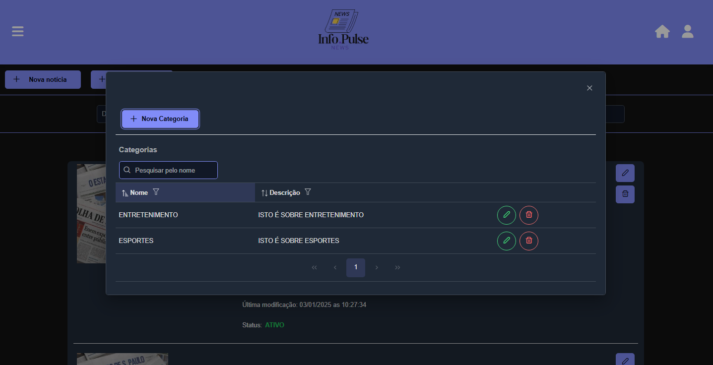

<h1 align="center">
  <a href="https://github.com/AbrahamLica/InfoPulse_frontend">
    <!-- Please provide path to your logo here -->
    
  </a>
</h1>

<div align="center">
  InfoPulse
  <br />
  <a href="#about"><strong>Explore the screenshots »</strong></a>
  <br />
  <br />
  <a href="https://github.com/AbrahamLica/InfoPulse_frontend/issues/new?assignees=&labels=bug&template=01_BUG_REPORT.md&title=bug%3A+">Report a Bug</a>
  ·
  <a href="https://github.com/AbrahamLica/InfoPulse_frontend/issues/new?assignees=&labels=enhancement&template=02_FEATURE_REQUEST.md&title=feat%3A+">Request a Feature</a>
  .
  <a href="https://github.com/AbrahamLica/InfoPulse_frontend/issues/new?assignees=&labels=question&template=04_SUPPORT_QUESTION.md&title=support%3A+">Ask a Question</a>
</div>

<div align="center">
<br />

[](LICENSE)

[](https://github.com/AbrahamLica/InfoPulse_frontend/issues?q=is%3Aissue+is%3Aopen+label%3A%22help+wanted%22)
[](https://github.com/AbrahamLica)

</div>

<details open="open">
<summary>Table of Contents</summary>

- [About](#about)
  - [Built With](#built-with)
- [Getting Started](#getting-started)
  - [Prerequisites](#prerequisites)
  - [Installation](#installation)
- [Roadmap](#roadmap)
- [Support](#support)
- [Project assistance](#project-assistance)
- [Contributing](#contributing)
- [Authors & contributors](#authors--contributors)
- [Security](#security)
- [License](#license)

</details>

---

## About

This is a Web News System that allows users to create, read, update, and delete news articles (CRUD), manage categories, and access additional features.
The project was developed to enhance and showcase my skills as a Fullstack developer.

<details>
  <summary>Screenshots</summary>
  <br>

|                            Home Page                             |                             Home Page                              |
| :--------------------------------------------------------------: | :----------------------------------------------------------------: |
|  |  |

|                              Register Page                               |                             Login Page                             |
| :----------------------------------------------------------------------: | :----------------------------------------------------------------: |
|  |  |

|                               Create category                                |                             Create News                              |
| :--------------------------------------------------------------------------: | :------------------------------------------------------------------: |
|  |  |

|                             Panel News Page                             |                             News Page                              |
| :---------------------------------------------------------------------: | :----------------------------------------------------------------: |
|  |  |

</details>

### Built With

🚀 Technologies Used <br>
This project was developed with the following technologies:

🌟 JavaScript – Powering the core functionality. <br>
🛠️ TypeScript – Ensuring type safety and cleaner code. <br>
🎨 TailwindCSS – For modern and responsive UI styling. <br>
🌐 Angular – A robust framework for building dynamic and scalable web applications. <br>
🖌️ PrimeNG – Delivering high-quality UI components. <br>
📏 PrimeFlex – Simplifying layout management with CSS utilities. <br>
🔗 Lodash – Enhancing productivity with utility functions. <br>
🎨 Font Awesome – Adding beautiful icons to the interface. <br>
☁️ Firebase – Used for storing and managing images efficiently.

## Getting Started

### Prerequisites

To run this project locally, make sure you have the following installed:

- **Node.js**: Version 18.12.1 or later. [Download Node.js](https://nodejs.org/)
- **npm**: Version 9.6.2 or later (comes with Node.js).
- **Angular CLI**: Version 18.2.2 or later. Install it globally using:
  ```bash
  npm install -g @angular/cli@18.2.2
  ```

### Installation

📦 Installation
To set up the project on your local machine, follow these steps:

🔗 Clone the repository
First, clone the project to your local machine using Git: <br>
bash
git clone https://github.com/AbrahamLica/InfoPulse_frontend.git <br>

📂 Navigate to the project folder
Change into the project directory: <br>
bash
cd InfoPulse_frontend

⚙️ Install dependencies
Install the required dependencies using npm. To avoid any potential version conflicts, use the --legacy-peer-deps flag: <br>
bash
npm install --legacy-peer-deps

🚀 Start the development server
Once the dependencies are installed, start the application locally: <br>
bash
ng serve -o <br>

After completing these steps, the application will be up and running on your local machine. 🎉

## Roadmap

See the [open issues](https://github.com/AbrahamLica/InfoPulse_frontend/issues) for a list of proposed features (and known issues).

- [Top Feature Requests](https://github.com/AbrahamLica/InfoPulse_frontend/issues?q=label%3Aenhancement+is%3Aopen+sort%3Areactions-%2B1-desc) (Add your votes using the 👍 reaction)
- [Top Bugs](https://github.com/AbrahamLica/InfoPulse_frontend/issues?q=is%3Aissue+is%3Aopen+label%3Abug+sort%3Areactions-%2B1-desc) (Add your votes using the 👍 reaction)
- [Newest Bugs](https://github.com/AbrahamLica/InfoPulse_frontend/issues?q=is%3Aopen+is%3Aissue+label%3Abug)

## Support

Reach out to the maintainer at one of the following places:

- [GitHub issues](https://github.com/AbrahamLica/InfoPulse_frontend/issues/new?assignees=&labels=question&template=04_SUPPORT_QUESTION.md&title=support%3A+)
- Contact options listed on [this GitHub profile](https://github.com/AbrahamLica)

## Project assistance

If you want to say **thank you** or/and support active development of infoPulse:

- Add a [GitHub Star](https://github.com/AbrahamLica/InfoPulse_frontend) to the project.
- Tweet about the infoPulse.
- Write interesting articles about the project on [Dev.to](https://dev.to/), [Medium](https://medium.com/) or your personal blog.

Together, we can make infoPulse **better**!

## Contributing

First off, thanks for taking the time to contribute! Contributions are what make the open-source community such an amazing place to learn, inspire, and create. Any contributions you make will benefit everybody else and are **greatly appreciated**.

Please read [our contribution guidelines](docs/CONTRIBUTING.md), and thank you for being involved!

## Authors & contributors

The original setup of this repository is by [Abraham Melquisedeque Pereira Licá](https://github.com/AbrahamLica).

## Security

infoPulse follows good practices of security, but 100% security cannot be assured.
infoPulse is provided **"as is"** without any **warranty**. Use at your own risk.

_For more information and to report security issues, please refer to our [security documentation](docs/SECURITY.md)._

## License

This project is licensed under the **MIT license**.

See [LICENSE](LICENSE) for more information.
