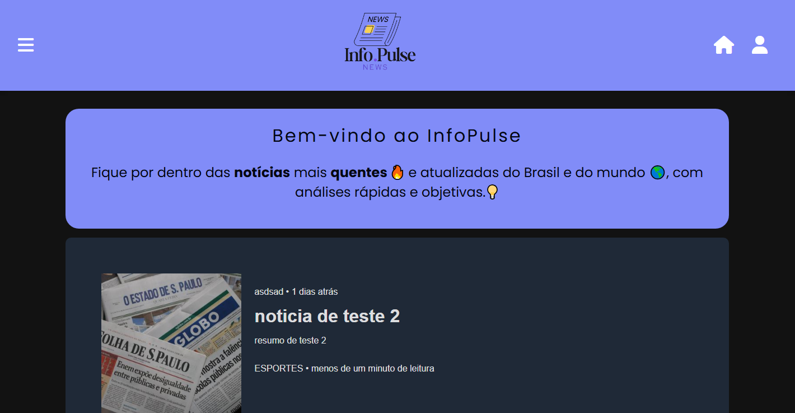
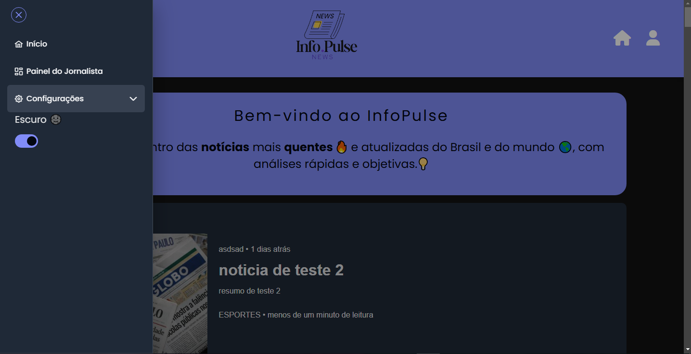
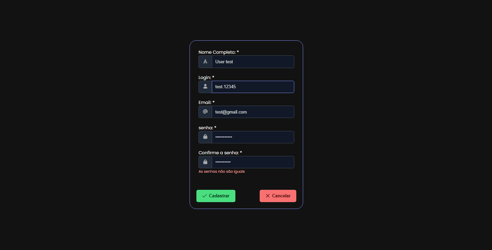
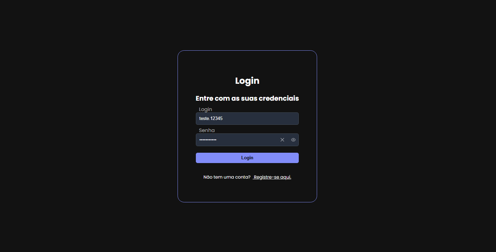
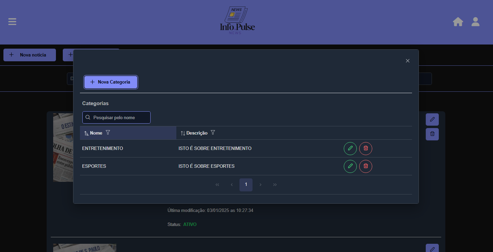
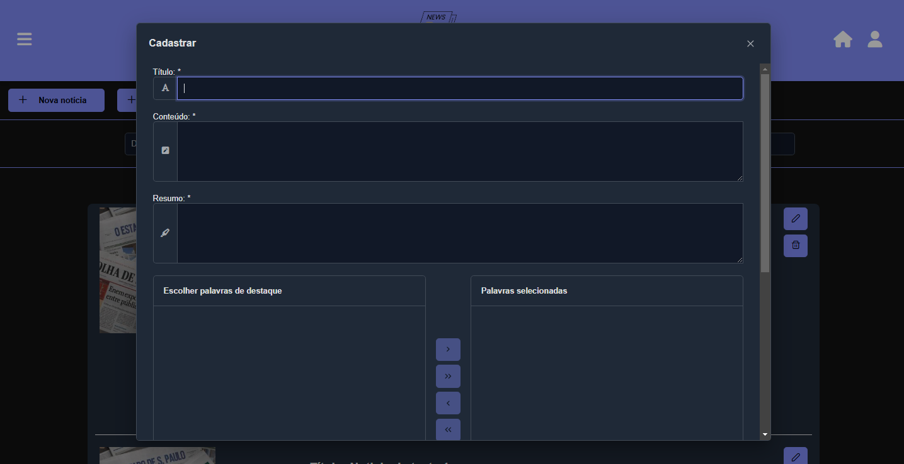
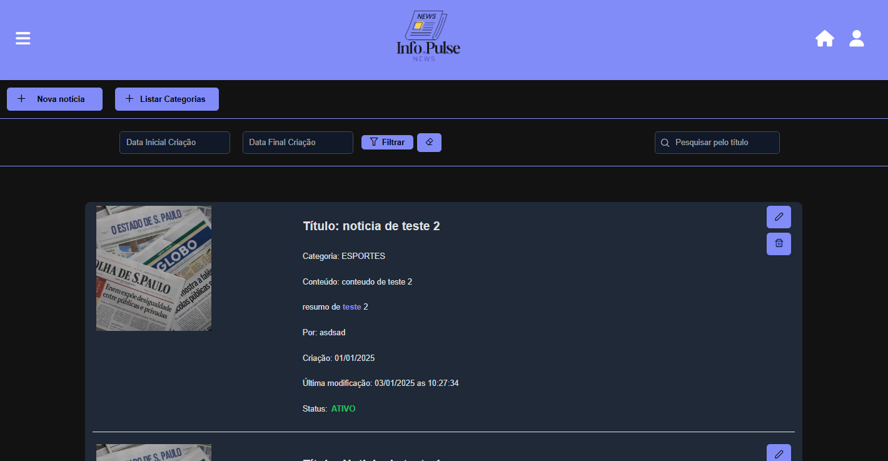
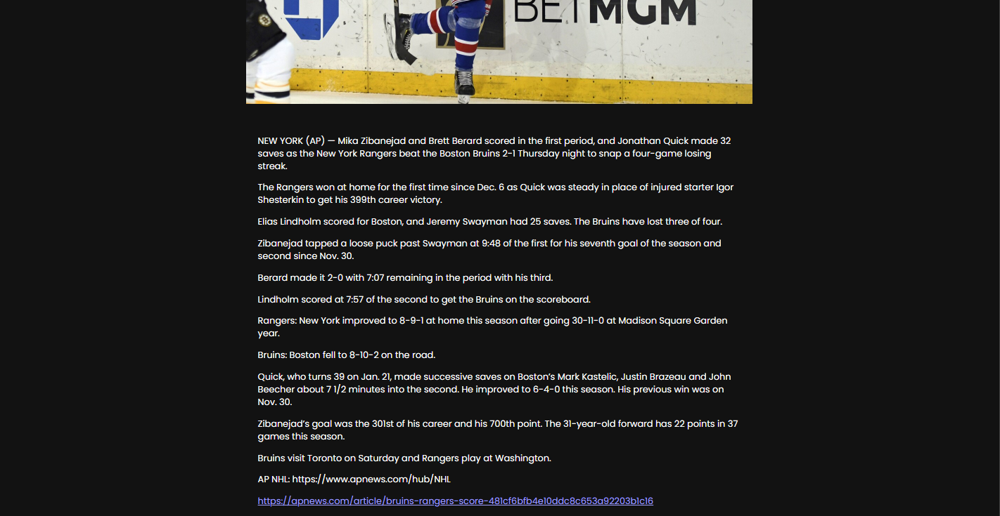

<h1 align="center">
  <a href="https://github.com/AbrahamLica/InfoPulse_frontend">
    <!-- Por favor, forneça o caminho para o seu logo aqui -->
    
  </a>
</h1>

[JAVASCRIPT__BADGE]: https://img.shields.io/badge/Javascript-000?style=for-the-badge&logo=javascript
[TYPESCRIPT__BADGE]: https://img.shields.io/badge/typescript-D4FAFF?style=for-the-badge&logo=typescript
[ANGULAR__BADGE]: https://img.shields.io/badge/Angular-red?style=for-the-badge&logo=angular

![javascript][JAVASCRIPT__BADGE]
![typescript][TYPESCRIPT__BADGE]
![angular][ANGULAR__BADGE]

<div align="center">
  📰 InfoPulse - Seu Sistema de Notícias Web
  <br />
  <a href="#about"><strong>Explore as capturas de tela »</strong></a> 
  <br />
  <br />
  🐞 <a href="https://github.com/AbrahamLica/InfoPulse_frontend/issues/new?assignees=&labels=bug&template=01_BUG_REPORT.md&title=bug%3A+">Reportar um Bug</a>
  ·
  ✨ <a href="https://github.com/AbrahamLica/InfoPulse_frontend/issues/new?assignees=&labels=enhancement&template=02_FEATURE_REQUEST.md&title=feat%3A+">Solicitar uma Funcionalidade</a>
  ·
  ❓ <a href="https://github.com/AbrahamLica/InfoPulse_frontend/issues/new?assignees=&labels=question&template=04_SUPPORT_QUESTION.md&title=support%3A+">Fazer uma Pergunta</a>
</div>

<div align="center">
  <br />

[](LICENSE)

[](https://github.com/AbrahamLica/InfoPulse_frontend/issues?q=is%3Aissue+is%3Aopen+label%3A%22help+wanted%22)
[](https://github.com/AbrahamLica)

</div>

<details open="open">
  <summary>Índice</summary>

- [Sobre](#sobre)
  - [Construído com](#Construído-com)
- [Começando](#Começando)
  - [Pré-requisitos](#Pré-requisitos)
  - [Instalação](#Instalação)
- [Roteiro](#Roteiro)
- [Suporte](#Suporte)
- [Assistência ao projeto](#Assistência-ao-projeto)
- [Contribuindo](#Contribuindo)
- [Autores & contribuintes](#Autores-&-contribuintes)
- [Segurança](#Segurança)
- [Licença](#Licença)

</details>

---

## Sobre

Este é um **Sistema de Notícias Web** que permite aos usuários **criar, ler, atualizar e excluir artigos de notícias** (CRUD), gerenciar categorias e acessar funcionalidades adicionais. 📚 O projeto foi desenvolvido para aprimorar e demonstrar minhas habilidades como **Desenvolvedor Fullstack**. 🚀

Além disso, este sistema integra-se com uma API externa chamada <a href="https://worldnewsapi.com/" target="_blank">World News API</a>, que permite ao sistema exibir notícias globais que não foram adicionadas pelos usuários da plataforma. Essa funcionalidade garante que o sistema não fique limitado apenas às notícias locais cadastradas pelos usuários, mas também ofereça acesso a notícias do mundo inteiro. 🌍

<details>
  <summary>Capturas de tela</summary>
  <br>

|                            Página Inicial                             |                             Página Inicial                              |
| :-------------------------------------------------------------------: | :---------------------------------------------------------------------: |
|  |  |

|                              Página de Cadastro                               |                             Página de Login                             |
| :---------------------------------------------------------------------------: | :---------------------------------------------------------------------: |
|  |  |

|                               Criar categoria                                |                             Criar Notícia                              |
| :--------------------------------------------------------------------------: | :--------------------------------------------------------------------: |
|  |  |

|                             Página do Painel de Notícias                             |                             Página de Notícias                              |
| :----------------------------------------------------------------------------------: | :-------------------------------------------------------------------------: |
|  |  |

</details>

### Construído com

Este projeto foi desenvolvido com as seguintes tecnologias:

- 🌟 **JavaScript** – Responsável pela funcionalidade principal.
- 🛠️ **TypeScript** – Garantindo a segurança de tipos e código mais limpo.
- 🎨 **TailwindCSS** – Para o design moderno e responsivo da interface.
- 🌐 **Angular** – Um framework robusto para a construção de aplicações web dinâmicas e escaláveis.
- 🖌️ **PrimeNG** – Fornecendo componentes UI de alta qualidade.
- 📏 **PrimeFlex** – Simplificando a gestão de layouts com utilitários CSS.
- 🔗 **Lodash** – Aumentando a produtividade com funções utilitárias.
- 🎨 **Font Awesome** – Adicionando ícones bonitos à interface.
- ☁️ **Firebase** – Usado para armazenar e gerenciar imagens de maneira eficiente.

## Começando

### Pré-requisitos

Para rodar este projeto localmente, tenha os seguintes itens instalados:

- **Node.js**: Versão 18.12.1 ou posterior. [Baixe o Node.js](https://nodejs.org/)
- **npm**: Versão 9.6.2 ou posterior (vem com o Node.js).
- **Angular CLI**: Versão 18.2.2 ou posterior. Instale globalmente com:
  ```bash
  npm install -g @angular/cli@18.2.2
  ```

### Instalação

📦 Instalação <br>
Para configurar o projeto na sua máquina local, siga os seguintes passos:

🔗 Clone o repositório <br>
Primeiro, clone o projeto para sua máquina local usando o Git:

```bash
git clone https://github.com/AbrahamLica/InfoPulse_frontend.git
```

📂 Navegue até a pasta do projeto <br>
Acesse o diretório do projeto:

```bash
cd InfoPulse_frontend
```

⚙️ Instale as dependências <br>
Instale as dependências necessárias utilizando o npm. Para evitar possíveis conflitos de versão, use a flag --legacy-peer-deps:

```bash
npm install --legacy-peer-deps
```

🚀 Inicie o servidor de desenvolvimento <br>
Após instalar as dependências, inicie o aplicativo localmente:

```bash
ng serve -o
```

Após completar esses passos, o aplicativo estará funcionando localmente em sua máquina. 🎉

## Roteiro

Veja as issues abertas para uma lista de funcionalidades propostas (e problemas conhecidos).

🏆 Principais Solicitações de Funcionalidades (Adicione seus votos usando a reação 👍) <br>
🐞 Principais Bugs (Adicione seus votos usando a reação 👍) <br>
🐛 Bugs mais recentes

## Suporte

Entre em contato com o mantenedor em um dos seguintes lugares:

📝 Issues do GitHub <br>
📬 Opções de contato listadas neste perfil do GitHub

## Assistência ao projeto

Se você quiser agradecer ou/lançar apoio ao desenvolvimento ativo do InfoPulse:

🌟 Adicione uma estrela no GitHub ao projeto. <br>
🐦 Faça um tweet sobre o InfoPulse. <br>
📝 Escreva artigos interessantes sobre o projeto no Dev.to, Medium ou seu blog pessoal. <br> <br>
Juntos, podemos tornar o InfoPulse ainda melhor! 🚀

## Contribuindo

Primeiro, obrigado por dedicar seu tempo para contribuir! Contribuições são o que tornam a comunidade de código aberto um lugar incrível para aprender, inspirar e criar. Qualquer contribuição que você fizer beneficiará todos os outros e será muito apreciada. 💖

Por favor, leia nossas diretrizes de contribuição, e obrigado por se envolver! 🙏

## Autores & contribuintes

A configuração original deste repositório foi feita por

<div align="center">  <br> Abraham Melquisedeque Pereira Licá </div>

## Segurança

O InfoPulse segue boas práticas de segurança, mas 100% de segurança não pode ser garantida. O InfoPulse é fornecido "como está" sem garantia. Use por sua conta e risco. ⚠️

Para mais informações e para relatar problemas de segurança, consulte nossa documentação de segurança [security documentation](docs/SECURITY.md).\_

## Licença

Este projeto está licenciado sob a **MIT license**. 📜

Veja [LICENSE](LICENSE) para mais informações.
